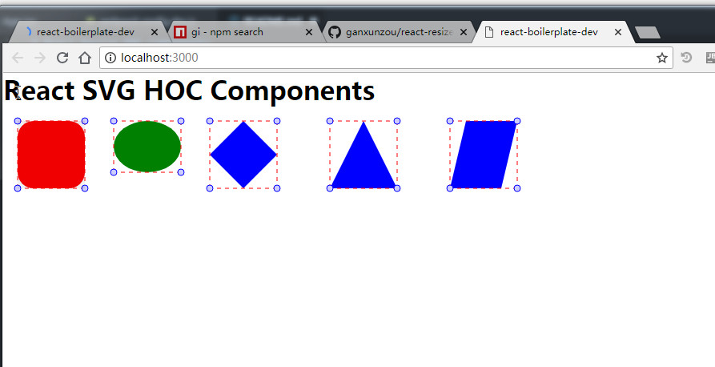
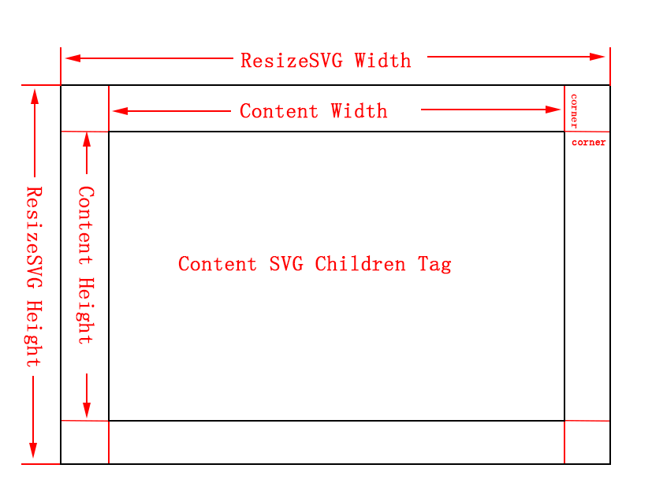
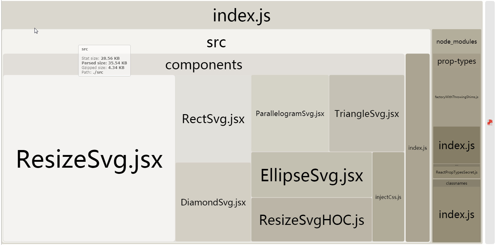

# React Resize HOC Components

Based on React implementation of the SVG component library that can be move(dragged) and scaled, the component library core two components: `ResizeSvg` and `ResizeSvgHOC`. 

# example image




# Document

## ResizeSvg & ResizeSvgHOC

### Resize SVG Box Model Analysis

`ResizeSvg` is shown in the following picture, divided into two parts: the outside area (`ResizeWidth * ResizeHeight`) and the content area (`ContentWidth * ContentHeight`). Where `padding` is also the diameter of the operable point (the dot of the four corners) (emphasis: diameter), default value: `8`



### Attribute API
| Attribute Name | type |Description |
|--|--|--|
|padding|number| padding default value：`8`|
|width|number| The width must be a number. Unit: px. But does not support: `100px` mode setting|
|height|number| The height must be a number. Unit: px. But does not support: `100px` mode setting|

### Style API
|ClassName Attribute|Description|
|--|--|
|svgContainerStyle|svg tag style|
|showLineStyle|show line style (default dasharray)|
|showCircleStyle|show circle style |
|triggerLineStyle|trigger line style |
|triggerCircleStyle|trigger circle style|
|triggerMoveRectStyle| trigger move rect style|

### Inject Props

Wrapped components by `ResizeSvgHOC` will auto inject Props

|Prop Name|type|Description|
|--|--|--|
|padding|number| padding|
|width|number| Actual width|
|height|number|Actual height|
|contentWidth|number| content width|
|contentWidth|number| content height|

### Use 

- npm install 

```
npm install react-resize-svg

```

- Custom SVG Component 

Develop a custom svg component based on `ResizeSvgHOC`. E.g:

```JSX
import React, { Component } from "react";
import ResizeSvgHOC from "./ResizeSvgHOC";

class EllipseSvg extends Component {
	render() {
    let { padding, contentWidth, contentHeight } = this.props;
		return (
			<ellipse
				cx={contentWidth / 2 + padding}
        cy={contentHeight / 2 + padding}
        rx={contentWidth/2}
        ry={contentHeight/2}
				style={{ fill: "green" }}
			/>
		);
	}
}
// important
export default ResizeSvgHOC(EllipseSvg);
```

After exporting components using `ResizeSvgHOC`, three new props will be added: `padding`, `contentWidth` and `contentHeight` for easy calculation and use. (The article above: Resize SVG box model analysis)

> You can't use `ResizeSvg` directly and then add the `svg` sub tag.


- Custom attributes (including style attributes `style`, `className`)

	- internal definition mode

		```JSX
		import React, { Component } from "react";
		import ResizeSvgHOC from "./ResizeSvgHOC";

		class EllipseSvg extends Component {
			render() {
				let { padding, contentWidth, contentHeight } = this.props;
				return (
					<ellipse
						cx={contentWidth / 2 + padding}			
						cy={contentHeight / 2 + padding}
						rx={contentWidth/2}
						ry={contentHeight/2}
						style={{ fill: "green" }}
					/>
				);
			}
		}
		export default ResizeSvgHOC(EllipseSvg);
		```

	- pass param mode
		```
		<RectSvg
			width="100"
			height="100"
			top="10"
			left="10"
			rx="20"
			ry="20"
			style={{ fill: "red" }}
			className={style.customClass}
		/>
		```

## Q&A

- The parent container that loads the ResizeSvg graphic, `position` must be `absolute`

> The scaling of the svg affects the size of the layer in which it is located. If the default layout is used, the overall document flow will be affected when the graphic is scaled, thus affecting the position of other graphics.

	```JSX
	// container position absolute
	<div style={{ position: "absolute" }}>
		<RectSvg
			width="100"
			height="100"
			top="10"
			left="10"
			style={{ fill: "red" }}
			className={style.customClass}
		/>
	</div>
	```


## Development

- dev

```
git clone 

npm i 

npm run start
```

- build

```
npm run build
```



